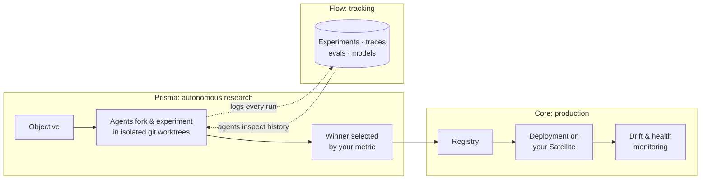
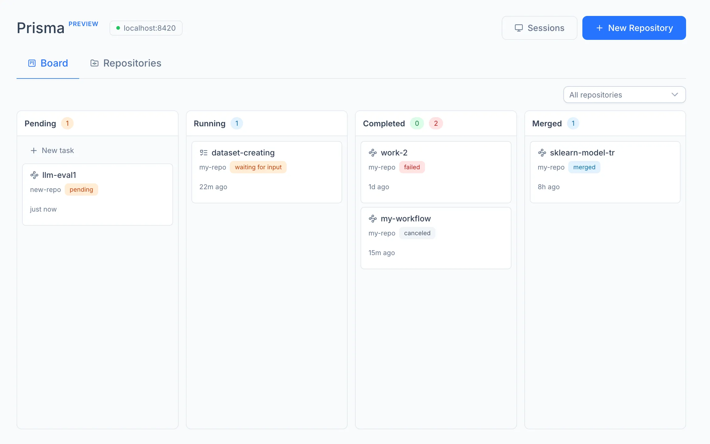
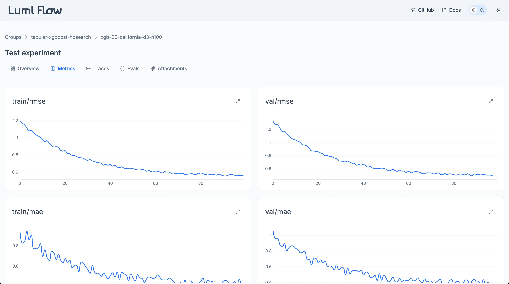
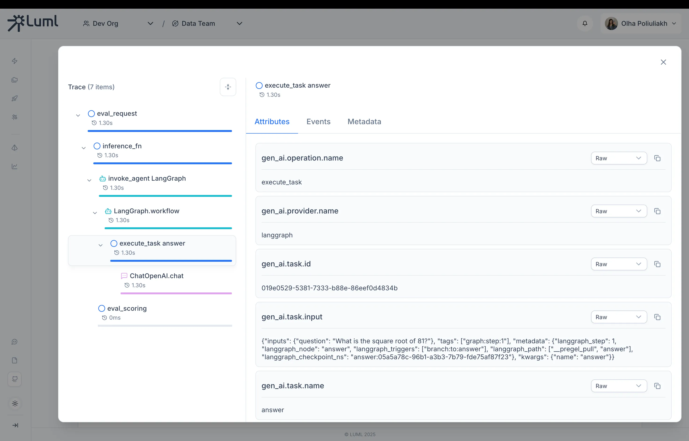
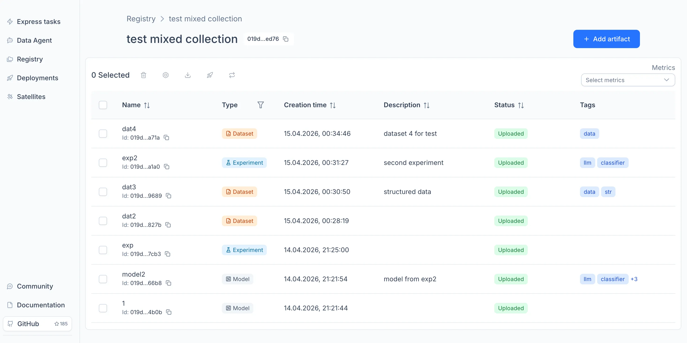
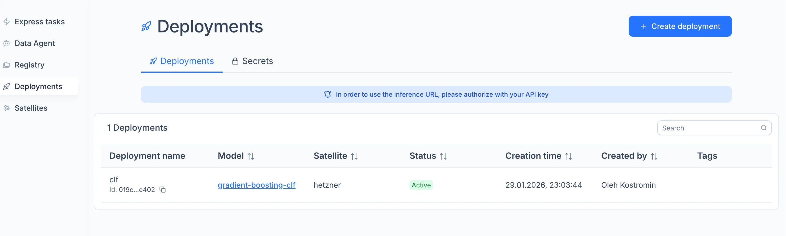

<p align="center">
  <picture>
    <source media="(prefers-color-scheme: dark)" srcset="https://gist.githubusercontent.com/OKUA1/1d730de58b9c7ccc3010d4e118552c5d/raw/379005eb32b69b6281e2c0be70fd82e5ef7bd456/luml_logo_full_white.svg">
    <source media="(prefers-color-scheme: light)" srcset="https://gist.githubusercontent.com/OKUA1/1d730de58b9c7ccc3010d4e118552c5d/raw/379005eb32b69b6281e2c0be70fd82e5ef7bd456/luml_logo_full_black.svg">
    
  </picture>
</p>


<p align="center"><b>The agent-native MLOps platform.</b></p>

<div align="center">

<a href="#prisma-agents-that-run-your-ml-research"><picture><source media="(prefers-color-scheme: light)" srcset="https://gist.githubusercontent.com/OKUA1/bae081e15b6efae41cc42c7f88c8c2a2/raw/8e82db4bbba01f768176560ce6f039113ebd3d30/prisma.svg"><source media="(prefers-color-scheme: dark)" srcset="https://gist.githubusercontent.com/OKUA1/bae081e15b6efae41cc42c7f88c8c2a2/raw/e2f73a24d9b77decd84d045ec28955fd3b82dbeb/prisma-darkl.svg"></picture></a>
<a href="#flow-a-local-interactive-experiment-tracker"><picture><source media="(prefers-color-scheme: light)" srcset="https://raw.githubusercontent.com/gist/OKUA1/bae081e15b6efae41cc42c7f88c8c2a2/raw/8e82db4bbba01f768176560ce6f039113ebd3d30/flow.svg"><source media="(prefers-color-scheme: dark)" srcset="https://gist.githubusercontent.com/OKUA1/bae081e15b6efae41cc42c7f88c8c2a2/raw/e2f73a24d9b77decd84d045ec28955fd3b82dbeb/flow-dark.svg"></picture></a>
<a href="#core-registry-deployments-monitoring"><picture><source media="(prefers-color-scheme: light)" srcset="https://raw.githubusercontent.com/gist/OKUA1/bae081e15b6efae41cc42c7f88c8c2a2/raw/8e82db4bbba01f768176560ce6f039113ebd3d30/core.svg"><source media="(prefers-color-scheme: dark)" srcset="https://gist.githubusercontent.com/OKUA1/bae081e15b6efae41cc42c7f88c8c2a2/raw/e2f73a24d9b77decd84d045ec28955fd3b82dbeb/core-dark.svg"></picture></a>

</div>

<p align="center">
  <a href="https://luml.ai">Website</a> ·
  <a href="https://docs.luml.ai/documentation/quickstart">Documentation</a> ·
  <a href="https://app.luml.ai">Hosted App</a> ·
  <a href="https://discord.com/invite/qVPPstSv9R">Discord</a>
</p>

Coding agents now do a growing share of ML engineering work: writing training code, tuning parameters, debugging failed runs. LUML is an MLOps platform built around that workflow. **Prisma** runs coding agents autonomously against a research objective. **Flow** records every experiment in a local, interactive tracker. **Core** moves selected models to production: registry, deployments, and monitoring. The platform is a control plane only: data, models, and inference traffic stay on your infrastructure.

<div align="center">
<picture>
  <source media="(prefers-color-scheme: light)" srcset="https://github.com/Dataforce-Solutions/static_assets/blob/main/luml-cta-light.png?raw=true" >
  <source media="(prefers-color-scheme: dark)" srcset="https://github.com/Dataforce-Solutions/static_assets/blob/main/luml-cta-dark.png?raw=true">
  
</picture>
</div>

## How it fits together



Each module also works on its own.

## Prisma: agents that run your ML research

Prisma runs coding agents (`Claude Code`, `Codex`, `Gemini CLI`, `Cursor`, `Copilot CLI`, `opencode`) as ML researchers that work unattended. It does not call LLM APIs itself. It drives agent CLIs installed on your machine, so your code stays local and your existing subscriptions apply.

```bash
pip install luml-prisma
luml-prisma        # local engine at http://localhost:8420, no account required
```

Open the Prisma board, register a repository, and state an objective, such as *"improve retrieval recall@3 of this RAG pipeline"*.



Each attempt runs in its own git worktree with automatic commits. Failed branches are discarded and winning branches merge back. The orchestrator forks an objective into parallel approaches, executes each one, retries failures with a debug step, and selects the winner by a single metric, within limits you set on depth, branching, and retries. Before proposing new directions, agents use `luml-inspect` to query metrics, parameters, and eval failures from earlier experiments. The objective does not have to be ML: Prisma can search over any code that reports a metric.

## Flow: a local, interactive experiment tracker

Flow is a local experiment tracker with an interactive UI for metrics, LLM traces, evals, annotations, and multi-run comparison. It stores data in SQLite and requires no server or account. Prisma agents log to it through the same SDK you use directly.

```bash
pip install lumlflow
lumlflow ui        # dashboard at http://127.0.0.1:5000
```

```python
from luml.experiments.tracker import ExperimentTracker

tracker = ExperimentTracker()   # local SQLite backend

tracker.start_experiment(name="gbm_baseline", group="iris", tags=["baseline"])
tracker.log_static("n_estimators", 100)               # hyperparameters
tracker.log_dynamic("loss", loss, step=step)          # metrics over time
tracker.log_model(model, name="gbm_final", inputs=X)  # packaged as a portable .luml file
tracker.end_experiment()
```

Flow can also act as a drop-in replacement for MLflow via the [`luml-mlflow`](extras/python/luml-mlflow/) plugin. Training code keeps calling the standard MLflow API, and runs appear in the Flow UI:

```python
# pip install luml-mlflow
import mlflow

mlflow.set_tracking_uri("luml://local")   # the only required change

with mlflow.start_run():
    mlflow.log_param("n_estimators", 100)
    mlflow.log_metric("accuracy", 0.94)
```

*Note: the plugin requires Python 3.12+ and MLflow 3.1+. Setting the URI to `luml://<org>/<orbit>` instead of `luml://local` syncs finished runs to the platform.*

For LLM systems, one instrumentation call captures every LLM request as a trace, including prompts, tool calls, latency, and token usage. Outputs can be scored with custom functions or with built-in metrics: correctness, relevancy, completeness, summarization, prompt alignment.

```python
from luml.experiments.tracing import instrument_openai

tracker.enable_tracing()
instrument_openai()   # every OpenAI call is now captured as a trace
```

| Metric charts | Trace viewer |
|---|---|
|  |  |

Runnable end-to-end examples for classical ML and LLM evaluation: [`lumlflow/README.md`](lumlflow/README.md).

## Core: registry, deployments, monitoring

Models leave the research loop as `.luml` artifacts: self-contained bundles of weights, metadata, dependencies, and preprocessing. `tracker.log_model()` packages scikit-learn, XGBoost, LightGBM, CatBoost, and LangGraph models automatically. The registry versions artifacts, links each one to the experiment that produced it, and organizes them into collections.

Deployments run on a **Satellite**, a compute node you host and pair with the platform using a token:

```bash
cd satellite
cp .env.example .env   # set SATELLITE_TOKEN from the platform UI
docker compose up -d
```

The Satellite polls the platform for work, so it needs no inbound access from the internet. It runs each model in an isolated environment and serves inference directly from your machine:

```bash
curl http://localhost/deployments/<DEPLOYMENT_ID>/compute \
  -H "Authorization: Bearer $LUML_API_KEY" \
  -H "Content-Type: application/json" \
  -d '{"inputs": {"feature_a": 1.0, "feature_b": 2.0}}'
```

Monitoring runs on the node itself: data quality, feature and output drift, and runtime health. Secrets are injected at deploy or invocation time and never reach telemetry.

| Registry | Deployments |
|---|---|
|  |  |

## Running the platform

The hosted app at [app.luml.ai](https://app.luml.ai) runs the platform without any setup. To run it yourself:

```bash
git clone https://github.com/luml-ai/luml && cd luml
printf 'UID=%s\nGID=%s\n' "$(id -u)" "$(id -g)" > dev/.env
docker compose -f dev/docker-compose.yml up
```

This starts the web app at http://localhost:5173, the API at http://localhost:8000/docs, and local Postgres and MinIO instances. A default admin account (`admin@example.com` / `admin12345`) is seeded automatically. Details in [`dev/README.md`](dev/README.md).

Storage (**Buckets**) and compute (**Satellites**) attach to project workspaces (**Orbits**). File transfers go directly between your client and your bucket, and Satellites pull tasks from a queue. Concept documentation: [docs.luml.ai](https://docs.luml.ai/documentation/Core-Concepts/organizations).

## How LUML compares

**MLflow and Weights & Biases.** Flow keeps the local workflow: install with pip, run your script, open the dashboard. Self-hosting MLflow for a team requires running a tracking server. W&B is a hosted product with no local equivalent. With Flow, experiments stay local until you upload them, and uploading brings collaboration, the registry, deployments, and monitoring. The `luml-mlflow` plugin makes migration a one-line change.

**SageMaker, Vertex AI, Azure ML.** LUML is cloud-agnostic. Storage and compute attach from any provider, so there is no infrastructure lock-in.

**Langfuse, LangSmith, Arize.** These tools focus on LLM observability. LUML covers classical ML and LLM workloads in the same lifecycle, from experiment tracking through deployment.

**Coding CLIs used directly.** The CLIs still write the code inside Prisma. Prisma sits one layer above: it runs many CLI invocations as separate experiments and decides what to try next from tracked experiment history. Each step starts in a fresh context, so no single session grows until quality degrades.

**Optuna, TPE, CMA-ES.** Classical optimizers search inside a fixed space, and they remain the right tool for that. Prisma works one layer up. It decides what the search space should be (architecture, features, loss) and can hand the numeric inner loop to whichever optimizer fits.

## Repository layout

| Directory | Contents |
|---|---|
| [`prisma/`](prisma/) | Autonomous ML research agents (`pip install luml-prisma`) |
| [`lumlflow/`](lumlflow/) | Flow, the local experiment-tracking dashboard (`pip install lumlflow`) |
| [`sdk/`](sdk/) | `luml-sdk`, the Python SDK: tracking, tracing, evals, `.luml` packaging |
| [`extras/python/luml-mlflow/`](extras/python/luml-mlflow/) | MLflow plugin (`pip install luml-mlflow`) |
| [`backend/`](backend/) · [`frontend/`](frontend/) | The platform: FastAPI control plane and Vue 3 app |
| [`satellite/`](satellite/) | Self-hosted compute node: deployments, inference, monitoring |
| [`wasm/`](wasm/) | In-browser Python: JupyterLite notebooks, WASM AutoML and inference |
| [`docs/`](docs/) | Documentation site |

## Community

Questions and feedback go to [Discord](https://discord.com/invite/qVPPstSv9R), bugs and feature requests to [issues](https://github.com/luml-ai/luml/issues). For contributions, the [dev stack](dev/README.md) provides a hot-reload environment for the whole platform. If you find LUML useful, starring the repository helps others discover it. ⭐

## License

[Apache 2.0](LICENSE)
