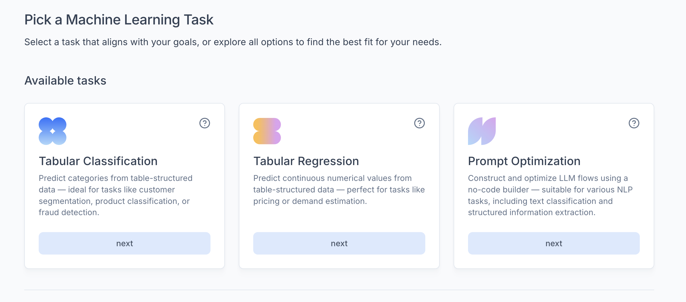
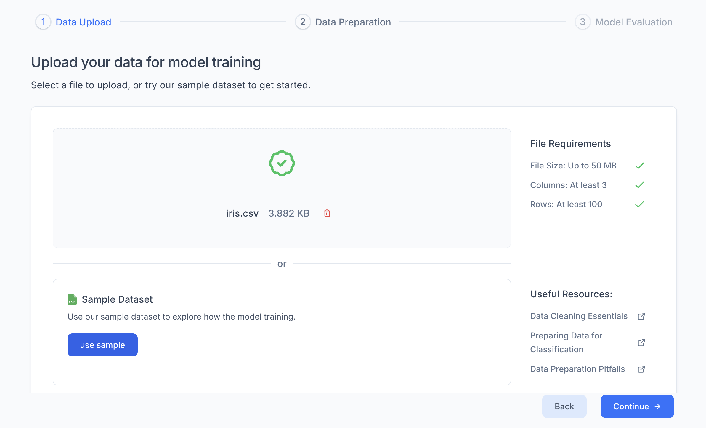
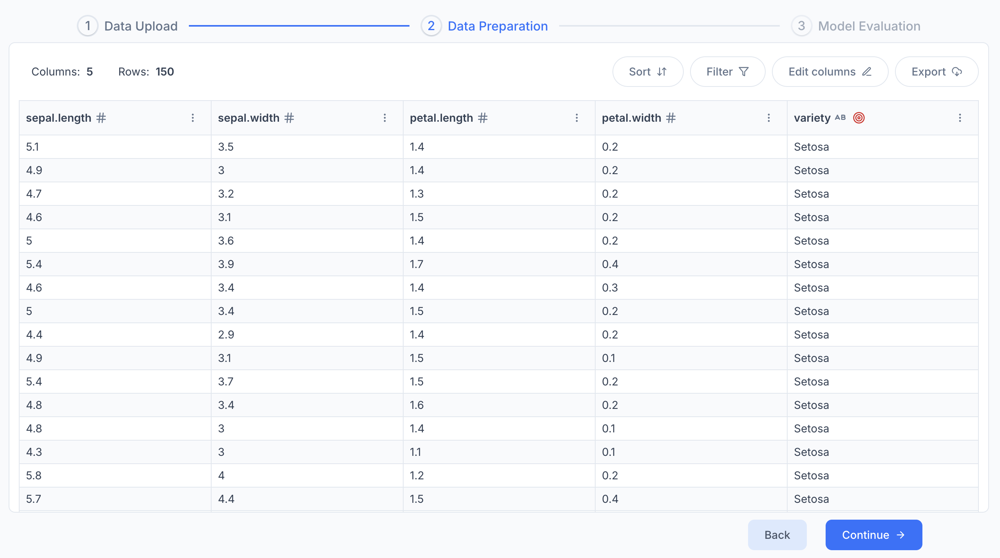
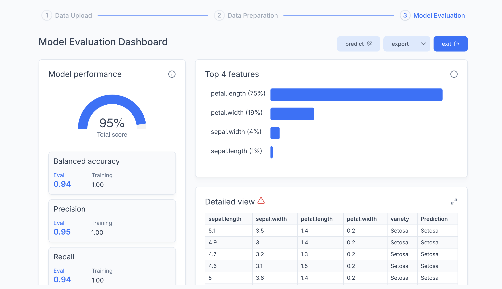
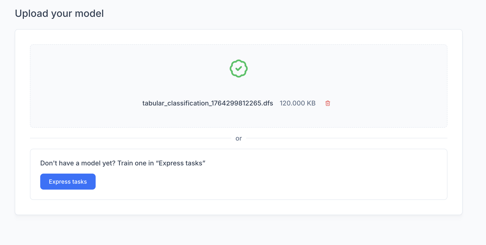
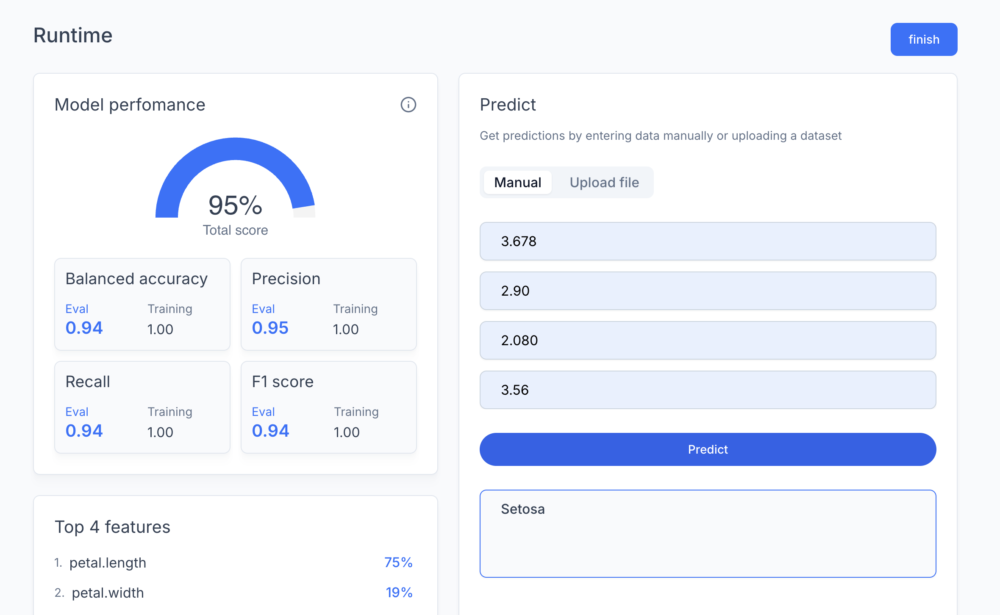

# Quickstart
LUML is a full-cycle MLOps/LLMOps platform. It supports working with both external models 
and the native **.dfs** format used by all system modules.

This tutorial outlines the process of creating a .dfs model using the **Express Tasks** tool and testing it via **Runtime** module.

## Step 1: Model Training (Express Tasks)
The fastest way to obtain a .dfs model is to use Express Tasks. 
This allows you to train a model without setting up an organization beforehand.

1. Navigate to the main page of the platform.
2. Select a task type (e.g., Classification).

3. Select data for training. You can use the built-in Sample Dataset or upload your own file 
(see data preparation requirements [here](../guides/Advices/dataset_preparation.md)).

4. Verify the Target Column settings. If necessary, change the target via the settings menu 
(three dots next to the column name).
5. Click <u>Train</u>.

Upon completion, the platform will display a dashboard with the model's performance metrics.

You can run inference on the model immediately, directly from this page! Just click on <u>Predict</u> and enter your values.

## Step 2: Export
To save the trained model:
1. Click the <u>Export</u> button on the results dashboard.

2. The file with the .dfs extension will be saved to your device.

## Step 3: Model Usage (Runtime)
The Runtime section allows you to use saved models for inference.
1. Navigate to the Runtime section in the platform menu.
2. Upload your .dfs file.

3. Review the uploaded model's metrics.
4. Enter input data and click <u>Predict</u> to see the results.

For access to the platform's full functionality (creating organizations, team collaboration, orbit management), please refer to the [full guide](../guides/user_guidline.md).