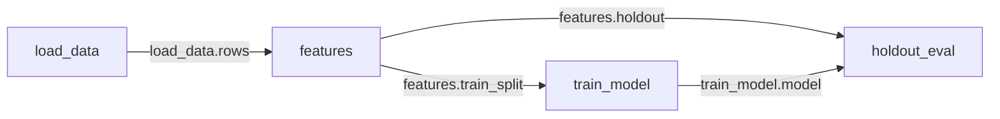

# Flows

A flow is a directory of Python cells. It also holds a store of everything those cells have produced. Each cell is one file under `cells/`. A cell is a class with a docstring. It declares literally what it consumes and what it produces. It defines a `materialize` method. Running a cell records its outputs as named, addressable **assets**, such as `features.train_split` and `train_model.model`. Each record also holds what the run consumed, what it cost, and who asked for it.

```python
# cells/train_model.py

class TrainModel:
    """Train the churn model on engineered features."""

    consumes = {"train": "features.train_split"}
    produces = {"model": "model", "run": "experiment"}
    params = {"lr": 3e-4, "epochs": 10, "seed": 1337}

    def materialize(self, ctx, train):
        ctx.seed()
        model = fit(train, lr=self.params["lr"])
        return {"model": model, "run": ctx.tracker.record}
```

Cells share no variables. They communicate only through declared inputs and outputs. The graph you see is therefore the graph the scheduler runs.



## When to reach for a flow

A notebook keeps its results in the kernel's memory. It keeps its order in the author's head. Re-run three cells out of sequence. The numbers on screen no longer correspond to the code on screen. Trying a second learning rate means copying a cell. Trying five means five copies that nobody can compare afterwards.

A flow answers those three problems directly. The flow keeps every version of every cell, so an edit overwrites nothing. Every result records the exact input versions it was computed from. A number on screen therefore traces back. Lanes are selections over the same cells rather than copy-pasted siblings, so five learning rates stay comparable. Cells are plain files with declarations that read without executing them. An agent can edit them, run them, and leave an audit trail you can read afterwards.

The cost is declaration overhead and the loss of ambient globals. For a ten-line throwaway, a notebook is less ceremony. Flows pay off when the results outlive the session. They pay off when several lanes are in flight. They pay off when an agent writes most of the code.

Flows sit next to Experiments, the tracker half of lumlflow. Flows do not replace Experiments. A cell that declares an `experiment` output produces a real tracked experiment. The workbench links out to its experiment screen.

## Getting started

Install lumlflow. Start it in the directory you want to work in:

```bash
pip install lumlflow
cd ~/projects/churn
lumlflow ui
```

```
workspace: /home/you/projects/churn
lumlflow at http://127.0.0.1:5000/?token=8f3c1d02e4b7a95614c0fd8823ab7e51
press Ctrl+C to stop
```

lumlflow runs in the foreground. Open the printed address. The address carries the key this browser needs for your workspace. Type the port by hand and the browser arrives without a key. Press Ctrl+C in that terminal when you finish. To run more than one project side by side, give each one its own port with `--port` (`-p`):

```bash
lumlflow ui --port 5001
```

The address opens on **Experiments**, the tracker half of lumlflow. Flows live under **Workspace**, the other tab in the header. Workspace browses the directory you launched lumlflow in. It lists folders and files for context. It lists a flow as one entry with one gesture. The row opens the flow. A flow's cells and its history are not files of the workspace. The browser therefore never walks into one.

Browsing goes up as well as down. The up arrow above the listing walks to the directory above. It walks above that one too, and lists each directory the same way. A flow in a project next door is therefore a few clicks away. It opens exactly like the ones at home. A flow you open from up there runs against the packages and the shared code of *its own* directory. That is the point. A workspace is one environment. A flow that borrowed another workspace's environment would run under packages nobody installed for it.

*Note: the workspace is the nearest directory at or above your launch directory that already holds flows. The packages panel, the shared `helpers.py` and the generated `AGENTS.md` belong to it. Creating a flow is the one gesture that stays inside it. The path printed on launch may not be the one you expected. Browse up to the one you meant instead of stopping lumlflow. Relaunch only when you want that directory's environment to be the one you work in.*

Create a flow from the *New flow* button at the bottom of the page. Name it `churn`. You get `churn.flow/` with a `cells/` directory, a `flow.yaml`, a store, and `main` on disk in it. The same thing from a terminal:

```bash
lumlflow init churn
```

Opening the flow lands on the workbench. An empty flow shows a heading and the command that scaffolds the first cell. It also shows one line of ways in: *add one here*, *pair an agent*, *AGENTS.md* (the generated DSL cheatsheet), and *notebook view*. *Pair an agent* hands you a prompt to paste into your agent. The agent connects itself back. Once it is paired, the canvas fills in as the journal streams its work. *Add one here* scaffolds a real file that you then fill in. The CLI equivalent is `lumlflow cells new features`. The new cell arrives under a placeholder name, `untitled_1`. The card shows that name in italics. Click it once you decide what the cell is. Naming it later costs nothing. Write a `materialize` that returns a dict matching `produces`. Then run the cell from the card's run button, or from a terminal:

```bash
lumlflow run features
```

The result appears on the cell's card as a rendered asset. A frame renders as a table. A plot renders as a chart. A metric renders as a number with its direction. A note renders as markdown. The store keeps that preview. Browsing a flow therefore never has to start Python.

## Writing cells

The filename is the cell's name, its **slug**. Everything else uses that one spelling to address the cell. There are no cell numbers. The graph is not linear, and agents rename constantly.

`consumes = {"name": "producer.output"}` wires inputs. Each key becomes an argument of `materialize`. A bare `"output"` resolves when exactly one cell on the lane produces it. lumlflow then rewrites it to the full spelling for you.

`produces = {"name": "asset"}` declares outputs. The four words are `model`, `dataset`, `experiment` and `asset`. They say what leaves the flow rather than what the value is. Declare `asset` unless you mean to publish, and promote later. lumlflow infers how to render a value from the value itself.

`params = {...}` holds declared configuration. You edit params from the card without touching source. Changing one lands a new version of the cell with a params-only difference.

A class with a docstring and nothing else is a **note cell**. It has no `materialize` and no declarations. A note cell is versioned markdown. It travels with the flow and appears under *docs* in the left panel.

The runtime enforces two rules. Assets are immutable. Never mutate a consumed input in place. Downstream cells and other lanes receive the same value. Cells are also non-interactive. `input()` fails immediately, because a typed answer is neither recorded nor replayable. Put configuration in `params`. Put credentials through `lumlflow secrets set NAME`. Read them inside a cell as `ctx.secret("NAME")`.

## The workbench

The workbench is one screen over one lane. The top bar names the flow. It carries the [lane switcher](#lanes), which scopes everything under it. The left panel describes that lane. The centre shows its cells in one of two views.

**Canvas** lays the cells out on the graph. Outputs come foremost, and source sits behind an accordion. The edges are the declared `consumes` wiring. **Notebook** is a single column. It accents the code and puts outputs below each cell, ordered topologically. The two views are two densities of the same cards over the same lane. Anything you do in one, you can do in the other. The canvas/notebook toggle in the top bar switches between them. The selected cell comes with you, and the other view opens scrolled to it. The view, the lane and the selected cell all ride the URL. A link to what you are looking at is therefore a link someone else can open.

The left panel is scoped to the lane you are viewing. Switching lanes re-scopes all of it. At the top is the lane identifier. It shows the lane's name, its state, and where it started from. Clicking it opens the lane map. Its step count opens the [step timeline](#lanes). A *new lane* action sits beside it. Under it is the current agent task, taken from the intent of the last transaction on the lane. Everything below is a section you can fold. **cells** is open, and the rest wait until you ask for them. The same cells appear through three lenses: **experiments**, **models**, and **data**. Data covers dataset outputs. It also covers cells that read files from outside the store, whose freshness the store cannot know. **docs** adds the lane's note cells. A lens with nothing on the lane is not listed at all. **Activity** is the journal's one home. It lists every transaction on the lane, newest first. It draws a *since you were here* divider when you have been away. Its *Summarize lane* button hands the lane to your agent, which writes the note. Its header carries the count when something landed while you were gone. **Packages** is the workspace environment. Its own header flags a kernel that is behind that environment. **Settings** holds the two settings there are. **Reactivity** decides what refreshes itself and what waits for you (see [Reactivity](#reactivity)). The second setting decides what happens to the running kernel when packages change.

The inventory lists cells, not files. Data files and shared helper modules beside the flow appear in Workspace, not here. The store does not version them.

### Cell cards

One card per cell, in both views. The header carries the slug, the kind of its primary output, and the run's timing. A status chip appears only where the status is something other than materialized. A chip on every card would carry no signal. The timing line reads what the run recorded, such as `2.4s · cached · 2h ago`. **cached** means the result came from a memo hit rather than a fresh run. A memo hit is not a zero-second run. **older env** means the recorded environment differs from the live one.

Under the header is a tab strip. It holds one tab per asset the cell produced, plus `code` and `logs`. While the cell runs, a live `console` tab streams its stdout and stderr. That tab becomes `logs` when the run finishes. Each materialization keeps its own logs. Rewinding therefore shows that run's output rather than the latest.

The `code` tab holds the source, editable in place. lumlflow attributes your edits to you. It records them whether or not the lane is on disk. Someone else may move the cell after your editor opens it. lumlflow then does not apply the edit silently. It offers *overwrite* or *save to a new lane*, and it suggests the new lane. Your edit lands on a new lane, and nothing is overwritten.

Every card is signed. It names who last edited the cell and the intent they recorded. The line's hover adds the creator and the step number. An agent session and a human share one set of files. A window where both plausibly edited reads *attribution uncertain*. lumlflow does not credit a confident wrong name.

The op row runs and changes cells. The run button opens a **preflight** first. The preflight names which cells are cached and which recompute. It states the expected total cost before anything starts. Running a cell runs the minimal stale closure it depends on. "Run this cell" may therefore run three cells, and the preflight names all three. *Force rerun* ignores cached results. It is always a labelled modifier, never the default. Stop cancels the run. If another lane waits on the same result, stopping only takes this lane out of the queue. The interface says so.

*Expand* is the first item of the overflow menu. It opens the full value in a right-hand drawer. The drawer holds configs, results, and paging through large frames. It holds the download for whichever output is open. A value that was never persisted offers *materialize and download* instead, with its cost. *Expand* is the first gesture that needs a live Python process. The interface says so before it starts one. Everything else on the card draws from the stored preview.

Two controls ride the row: the run button and the overflow menu. The overflow menu holds the rest in four groups. The first group holds expand and send to agent. The second holds rename, add cell downstream, and duplicate. The third holds promote an inline asset to LUML and the per-asset **eager** toggle. Eager is how you exempt one cell from the reactivity threshold. The fourth holds delete, on its own at the bottom. (Downloading a value lives with the value, in the drawer that *expand* opens.) Two of these behave differently from their notebook equivalents. **Rename** is free. References bind to a cell's identity rather than to its name. Renaming rewrites the filename and every reference at once. Nothing goes stale, and nothing loses its cache. Renaming the file with `mv` does the same thing. **Delete** is per-lane. The cell drops out of this lane's selection. Every other lane keeps its own. A consumer left pointing at nothing here shows a flagged reference with a suggestion. It does not break silently.

### What stale means

A cell is **stale** when the result on record no longer corresponds to the cell as it now stands. The result is still there. It is still readable. It is still the result of the run that produced it. Staleness is a claim about correspondence, not a deletion. Nothing recomputes behind your back beyond what the reactivity setting below allows. The preflight tells you what a run costs before it starts.

The status vocabulary is small: `materialized`, `running`, `stale`, `failed`, and `unmaterialized`. The last one is its own state and never a flavour of stale. The asset has no recorded result anywhere. There is no baseline to claim a change against.

Stale always names its cause in words. The cause may be your edit to the cell. It may be a rewiring of its inputs. It may be a parent that rematerialized. It may be a change to shared workspace code (`helpers.py changed`). By default the workbench shows direct causes only. One edit near the root of a large graph would otherwise light up everything downstream and tell you nothing. The top bar's one-line summary counts cells that are stale only because something upstream is stale. That summary reads *1 stale · 14 downstream · 1 never materialized*. It opens on the first cause and on the toggle that tints them.

The CLI uses the same word. `lumlflow cells list --stale` and the "stale" section of `lumlflow context` list exactly the cells the workbench marks stale.

### Reactivity

Going stale and recomputing are two different events. The **reactivity** setting is the whole of what connects them. It ships on `auto`. The contract is one sentence: *cheap results keep themselves fresh; expensive ones wait for you to ask.*

On `auto`, several events count as a change. You edit a cell in the workbench. An agent edits one. You save the file in your own editor. You use or rewind a lane. After any of these, the flow settles for a moment. It then recomputes every stale closure it can already vouch is cheap. "Cheap" means one thing precisely. The whole closure the cell depends on has run here before, so its cost is on record. That recorded total is at or under the threshold beside the switch. Everything else stays exactly where it was. **The card says why** rather than sitting there silently stale:

- **too expensive to refresh on its own (~9m)**. The closure is timed and over the threshold. Raise the threshold, mark the cell eager, or press run.
- **never run here, so its cost is unknown**. Nothing in the closure has ever finished on this flow. An unmeasured cost is not a small one. Reactivity does not gamble a threshold on it. Run the cell once, and it keeps itself fresh from then on. This is also why opening a fresh flow never starts anything, however small the cells look.
- **waiting on a failed cell above it**. A run in the closure failed, and nothing has changed since. Retrying on every pass would be a loop. The next edit is what makes another try worthwhile.

Three consequences worth knowing:

- **Reactivity stops at the first cell it cannot afford.** Edit something near the root of `load → features → train → report`. The cheap start of the chain refreshes itself. `train` and everything under it stay stale and say so. Running `train` yourself releases the rest. `report` refreshes on its own once its parent is paid for.
- **It can start Python.** A refresh is a real run. On `auto`, an edit may start the kernel without your asking. Everything else in the workbench still reads stored previews.
- **Its runs carry `auto` as the author, not you.** They appear in Activity under that name. They arrive as a single *Refreshed automatically* notice rather than one notice per cell.

`lazy` turns all of it off. Cells go stale and nothing runs. The run button is the only thing that computes anything. The threshold disappears with it, because nothing is weighed.

**Eager** is the per-asset exception, on the card's overflow menu. A cell marked eager rematerializes whenever something above it changes. It does so whatever the closure costs. It does so whether or not the closure has ever been timed. Eager suits the one plot you always want current. It does not override the failure rule. It does nothing under `lazy`. The setting is per cell and keyed to the cell's identity, so renaming keeps it.

Both settings live in `flow.yaml`. Neither is journalled. They decide what the runtime does next rather than record something that happened.

## Lanes

A lane is a selection. For every cell, it says which version this lane uses. Starting a lane copies that selection and nothing else. It copies no files, no values, and no history. Starting a lane is therefore instant, however large the flow is. Nothing you do on a new lane reaches back into its parent.

```bash
lumlflow lane new exp/lr-sweep -m "try a lower learning rate"
```

In the workbench, **new lane** does the same thing from two places. It sits in the lane switcher's footer in the top bar. It also sits in the lane identifier at the top of the left panel. Either one asks for a name. Either one starts from the lane you are *viewing*, at its newest step. Either one leaves you viewing the lane it just made. Nothing is copied, so the gesture is instant however large the flow is.

Inputs stay pinned at the point where the lane started. A sweep of five lanes therefore stays comparable even if `main` moves underneath it. Editing a cell on the new lane gives that cell a new version on that lane only. Every other lane keeps resolving its own. Nothing is ever overwritten. An edit adds a version. It does not replace one.

Reading a lane and working on a lane are two different gestures. **Viewing** any lane is free and always available. It works even while an agent is working on that lane. The **lane switcher** in the top bar is the shortcut. It lists every lane with its state and its step count. Picking one re-scopes the whole screen: panel, canvas, and URL. That re-scope is a store read. It takes no lock and starts no kernel. The **lane map** is still the map. Click the lane identifier to reach it. The map shows where each lane started. It is also where you pick two to five lanes to compare.

**Use** rebinds the flow's files to a lane. It sits deliberately one gesture deeper than browsing. It is the *use here* line in the switcher's footer, which first states what it moves. It is the one gesture that has to wait for an agent that holds the files.

```bash
lumlflow lane use exp/lr-sweep
```

**Rewind** restores a lane to an earlier step. It is instant and recomputes nothing. It swaps the selection back to what the lane pointed at then. Every value any recorded step referred to is still in the store. Any step is a valid target. `lumlflow lane list` and the activity feed show the steps. They also show the intent recorded with each step.

```bash
lumlflow rewind 42 -m "back to before the feature rewrite"
```

In the workbench, the step count in the lane identifier holds the steps of the lane you are viewing. Click *30 steps* to open the **step timeline**. The timeline lists the lane's transactions newest first. Each row carries the intent, who made it, and when. It marks the step the lane stands on as *current*. It offers a rewind on every older step, behind a line that names what the rewind restores. The activity section further down the panel is the same history read the other way. It shows what happened, with its summaries and its *since you were here* divider. The timeline is where you move. Activity is where you read.

**Mark this point** sits at the top of that timeline. The journal already records every change. A checkpoint therefore copies nothing and freezes nothing. It is one line saying this step was worth naming, under a sentence you write. It becomes the lane's checkpoint in `lumlflow context`. It reads back in the timeline as a flagged row. You can rewind to it like any other step. Without one, `lumlflow context` reports the last step the lane was whole at. That is a useful answer, but not one anybody chose.

**Archive** puts a lane away without deleting anything it produced. Archived lanes collapse behind a toggle in the lane map.

## Comparing lanes

Select two to five lanes in the lane map. Open Compare. The comparison has three sections. Results and divergence are open. Links waits until you ask for it. Links is a set of links to follow.

*Results* is one column per lane, aligned by asset. Headline outputs appear as figures. Shared metrics overlay as curves. Some lanes were not computed comparably. The causes are divergent pins, a different dataset, or a different scorer. Compare renders that warning inline rather than leaving it for you to notice. A side-by-side of two numbers computed differently is worse than no comparison.

*Divergence* separates two kinds. A **definition divergence** is someone editing a cell. It is rare and structural. Compare renders it as the point where the lanes split, with both versions side by side. A **materialization divergence** is the same code over different inputs. It covers nearly everything downstream of any edit. It therefore collapses into one row per asset, with a result chip per lane. Some differences have no shape to render, such as renames, absences, and params-only changes. An exhaustive *all differences* table behind its own disclosure lists them. Nothing is unreachable just because it did not fit the layout.

*Links* lists what the compared lanes produced. Each entry links out. Experiments link to their experiment screen. Models link to their model card.

From here you take the winner back. **Adopt** copies one cell's version from one lane onto another:

```bash
lumlflow adopt train_model --from exp/lr-sweep -m "the lower lr won"
```

Adopt rebinds the cells that consume it and reports them. Both lanes may have edited that same cell since they diverged. Adopt then stops and asks which side wins rather than guessing. Adopt is per-cell. A whole-lane adopt does not exist. Picking the two or three cells that actually changed is the intended path.

To take a lane's cells out of the flow entirely, run `lumlflow export flow.py`. It writes them as one Python file. It is a file export. It carries the cells as they stand, with no history, no results, and no other lanes. `lumlflow import` reads the file back. Each cell keeps the identity it left with, so a round trip is a round trip.

## Working with an agent

lumlflow does not embed an agent. It does not launch yours either. Yours connects to it. Click *pair an agent* in the left panel's identity line, or on an empty flow. Copy the prompt it hands you into your agent's session. The prompt names the flow and workspace it pairs with. It carries the MCP server configuration for that workspace. It states the rules that hold here. It says how you edit this flow's cells. It says that runs go through the tools. It says that `input()` fails.

You confirm nothing in the browser. You configure nothing twice. The moment your agent connects, the line at the top of the left panel changes. It flips from *not paired* to the agent's label and what the agent is working on. Everything the agent does from then on is recorded under that name. The label is your harness's own name unless the configuration says otherwise. `--label <name>` in the arguments changes it.

Reading owns nothing. A connected agent that is only orienting itself does not hold the flow's files. You can still use, rewind and adopt while it reads. The first thing the agent *changes* takes the files. That is what makes its edits to `cells/` its own rather than yours. That is also what makes the use you ask for meanwhile wait or force. The session ends when the agent disconnects, when it is killed, or when you close the terminal. The files are then free again, without anybody having to say so.

Working without an agent is a supported state, not an error. A human editing cells is a first-class actor. The workbench says so once rather than nagging.

An agent reads the generated `AGENTS.md` at the workspace root. It learns the tools, the DSL and the verbs there. Keep your own instructions in that file outside the generated markers. lumlflow preserves them.

An agent that is itself a CLI takes a wrapper instead. `lumlflow agent exec -- <command>` brackets the process with a session. It attributes the process's edits to that session.

Talking to your agent about a specific thing is a **send-to-agent** gesture. It sits in every card's overflow menu, on every error, and on every comparison. It builds a context block and copies it for you. Paste that block into the agent's session. Each gesture carries its own payload:

- **Fix this**, from a failed cell: the lane, the cell, the version step, and the traceback.
- **Explain this**, from any card: the lane, the cell, and its docstring, as it stands right now.
- **Explain this diff**, from a comparison: how the compared lanes actually differ.
- **Summarize this lane**, from the left panel: the lane's cells, their states, and the intents behind them. The agent writes the summary back as a note cell, so it becomes a versioned part of the flow.

The address in every payload is the slug, the lane, and the step. Internal identifiers never leave the store. The thing your agent is told to fix is therefore the thing you can name out loud.

What the agent did is the **activity** section of the left panel. The catch-up marker in the top bar opens there too. Every mutation is one transaction carrying an intent string. Mutations include an edit, a run, a new lane, an adopt, a rename, and a package change. The feed is those transactions, newest first and read-only. Agent-authored failures do not interrupt you. The cell's chip goes to failed, and the traceback fills its `logs` tab. A later version by the same author may repair it. The pair then folds into one history entry (`v3→v4 · 1 failed attempt`). Failures in code you wrote surface loudly, with *Fix this* attached.

Reopening the workbench after time away lands on the lane on disk. It shows how far behind you were, as *N changes since you were here*. It opens the feed at that point. Edits you make while lumlflow is not running arrive as one coarse entry attributed to you. lumlflow did not observe the individual steps.

The interface does not claim to do two things. Stopping a run stops the run, not your agent. That process is not lumlflow's. Ctrl+C in its own terminal is what ends it. Cancelling work on one lane does not make an agent move on to the next. It cancels the work. It optionally hands the agent a payload saying so.

## Packages and the kernel

Every flow under a workspace shares one environment, resolved from one lockfile. The *packages* section of the left panel lists that environment and changes it. The CLI is equivalent:

```bash
lumlflow env status
lumlflow env add lightgbm
lumlflow env remove xgboost
```

Installing or removing a package never invalidates a recorded result. A materialization keeps the environment it ran under as provenance. A card whose recorded environment differs from the current one says so on its badge.

The live Python process does need attention. It cannot swap out packages it has already imported. After an install, the *packages* header carries a warning mark. The section shows *restart kernel to apply* with the button. Restarting loses nothing. The process holds no state that the store does not hold. lumlflow drains the queue rather than retrying it silently. The *on env change* setting decides whether lumlflow offers a restart, takes one automatically, or never suggests one. It sits in the *settings* section at the foot of the panel.

You never have to start, select, or connect anything. Opening a flow is all the attaching there is. Python starts on the first gesture that actually needs it. Those gestures are expanding a value, paging a frame, diffing, and running a cell. On `auto`, a refresh that reactivity decided on is one of those gestures too. Everything else reads stored previews.

## Command reference

Everything the workbench does is also a verb. Both write to the same store. The interface updates live when you run a verb in a terminal. Every verb takes `--json` for the answer verbatim. Verbs that change a cell or a lane take `-m "why"`. The history reads that message back. `--flow` picks a flow when the workspace holds several. `--lane` defaults to the lane on disk.

| Verb | Purpose |
|---|---|
| `lumlflow init [name]` | Scaffold a flow here and put `main` on disk in it |
| `lumlflow status` | The workspace, its flows, and what is stale in each |
| `lumlflow context` | Where you are, what is stale and why, what broke, what it will cost |
| `lumlflow lane list` | Every lane, where it started, and how it stands |
| `lumlflow graph [--around <cell>] [--depth n]` | The declared wiring, the graph the scheduler runs |
| `lumlflow run <cell[.output]> [--force]` | Run a cell, and whatever it needs, first |
| `lumlflow preflight <cell[.output]>` | What running it would recompute, reuse, and cost |
| `lumlflow cancel` | Stop waiting on the run this lane asked for |
| `lumlflow eval "<python>"` | Try something against a lane's values; it writes nothing |
| `lumlflow lane new <name> [--from <lane>]` | Start a lane; it copies no file and no value |
| `lumlflow lane use <lane> [--force]` | Put a lane on disk: rebind the files to its selection |
| `lumlflow rewind <step> [--force]` | Restore a lane to a step; nothing recomputes |
| `lumlflow adopt <cell> --from <lane>` | Take one cell's version from another lane onto this one |
| `lumlflow lane archive <lane>` | Put a lane away; nothing it produced is deleted |
| `lumlflow diff <a> <b> [...]` | How two to five lanes differ |
| `lumlflow rename <cell> <new-name>` | Rename a cell; references follow, nothing goes stale |
| `lumlflow promote <cell[.output]>` | Publish a stored asset to LUML |
| `lumlflow export <file.py>` | Write a lane's cells out as one Python file |
| `lumlflow import <file.py>` | Read an exported file back into a lane, cell for cell |
| `lumlflow cells list [--stale]` | What this lane holds |
| `lumlflow cells show <cell>` | A cell in full: state, declarations, last run, source |
| `lumlflow cells new <cell> [--after <producer>] [--doc]` | Scaffold a cell, wired to what it comes after |
| `lumlflow cells edit <cell> [--source <file>]` | Replace a cell's source, attributed to you |
| `lumlflow cells delete <cell>` | Drop a cell from this lane; other lanes keep theirs |
| `lumlflow asset preview <cell[.output]>` | What a cell produced, from the stored preview |
| `lumlflow asset page <cell[.output]> [--offset --limit]` | Read into a value; this is the gesture that starts Python |
| `lumlflow asset diff <cell> --lane a --lane b` | One cell's code and results across two lanes |
| `lumlflow asset download <cell[.output]> [--to <path>]` | Copy a stored value out of the flow |
| `lumlflow agent exec -- <command>` | Wrap an agent that is itself a CLI, with its edits attributed to it |
| `lumlflow agent begin --label <name>` / `agent end` | Register or end a session by hand |
| `lumlflow env status` / `env add <pkgs>` / `env remove <pkgs>` | The workspace's packages |
| `lumlflow secrets set <NAME>` / `secrets list` | Secrets a cell reads with `ctx.secret("NAME")` |
| `lumlflow flow delete <name>` | Delete a flow: its cells, its store, its history |
| `lumlflow mcp [--workspace <dir>] [--label <name>]` | Serve this workspace to an agent over MCP (spawned by the agent's harness) |
| `lumlflow root` | The workspace this directory belongs to |

The older spellings still work. `fork`, `switch`, `tree`, `archive`, `--branch` and `--unsynced` do not appear in help.

## Troubleshooting

**"lumlflow is not running."** The page shows the last state it knew, marked as such. Nothing updates. Start lumlflow again from the workspace directory with `lumlflow ui`. The banner carries that command. The page then reconnects. Nothing recorded is lost while lumlflow is down. lumlflow picks up the edits you made to cell files meanwhile. It records them as one entry attributed to you.

**"This tab is not connected."** The tab holds no key this run accepts. The key comes with the address `lumlflow ui` prints. It stays in the browser once a tab has taken it. Reopening the browser or opening a second tab therefore connects on its own. It does so for as long as that run is up. A port typed by hand arrives without a key. So does a bookmark. The browser takes the key back out of the address bar once a tab holds it. The browser keeps the key per address, so `localhost` is not `127.0.0.1`. Restarting lumlflow mints a new key and brings the banner back. Open the address from the terminal again either way.

**The port is already in use.** Another program holds 5000. That program is often lumlflow already serving a different project. Pick another port with `lumlflow ui --port 5001`. Open the address it prints. Each project you run this way is independent.

**lumlflow answered on a different port than you asked for.** A run you started from a terminal was still in flight. `lumlflow ui` does not restart the process carrying that run. It attaches to that process instead. It prints the address that is actually serving and names the port. Work there. Or wait for the run to finish, then start `lumlflow ui` again to get the port you wanted.

**Everything reads stale after an edit.** This is expected, and not an error. A cell whose source or params changed is stale until you rerun it. So is anything the change reaches. Lead with the direct causes named on each chip. Use the run button's preflight to see what recomputing actually costs. Turn on the downstream toggle when you want the full extent. Nothing was lost. The previous results are still stored and still readable.

**Reactivity is on `auto` and a stale cell is not refreshing itself.** Read the line on its card. It names the reason: over the threshold, never timed here, or waiting on a failure above it. See [Reactivity](#reactivity). Two responses act on it directly. Run the cell once, which teaches the flow its cost. Or raise the threshold in *settings*.

**Something ran that I did not ask for.** On `auto`, that is reactivity refreshing a closure it had already timed under the threshold. Activity attributes those runs to `auto`. The timeline therefore says which runs they were. Switching the setting to `lazy` stops all of it.

**The whole graph went stale after editing a helper.** lumlflow watches shared `.py` files beside the flow. Editing one marks every cell that could import it. The mark names the file as the cause. Writing an export with a `.py` extension into the workspace has the same effect. Write exports outside the workspace to avoid it.

**A cell failed.** The chip reads failed. The full traceback sits in the cell's `logs` tab. `lumlflow context` prints the same thing in a terminal. If an agent is working, use *Fix this*. It hands the agent the cell and the traceback, so you retype neither.

**The run died taking the whole queue with it.** A kernel that runs out of memory raises a banner. The banner names the cell that was materializing and carries a restart button. lumlflow drains the queue rather than retrying it behind your back. Nothing recorded is lost. Everything the store holds is on disk.

**"The agent is working in the files."** An agent session holds the flow's files while it runs. Viewing any lane keeps working. So does reading any card, and so does comparing lanes. Only use, rewind and adopt wait. Each of the three offers a force option. lumlflow records an edit you make in the meantime straight away. The card reads *saved · not yet written to files* until the files are free.

**A card shows a flagged reference.** A cell points at something this lane does not have. This usually follows a delete or a rename on this lane only. The flag carries a suggestion. Applying it rewrites the reference. lumlflow accepts flagged versions rather than rejecting them. An agent iterating through a half-finished state therefore never loses work.

**A flow is missing from Workspace.** You are looking at a different directory than you think. The path under the Workspace heading is the directory lumlflow resolved on launch. `lumlflow root` prints the same thing. Walk up with the arrow above the listing until the flow appears. Open it where it is. You stop and restart nothing. A flow opened this way runs under its own directory's packages rather than this one's. If you want it on this project's environment, relaunching there is still the move.
