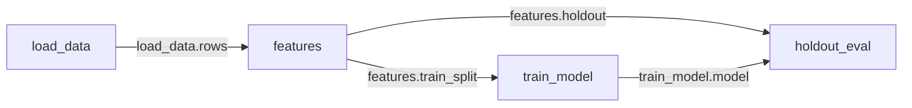

# Flows

A flow is a directory of Python cells. It also holds a store of everything those cells have produced. Each cell is one file under `cells/`. A cell is a class with a docstring. It declares literally what it consumes and what it produces. It defines a `materialize` method. Running a cell records its outputs as named, addressable **assets**, such as `features.train_split` and `train_model.model`. Each record also holds what the run consumed, what it cost, and who asked for it.

```python
# cells/train_model.py


class TrainModel:
    """Train the churn model on engineered features."""

    consumes = {"train": "features.train_split"}
    produces = {"model": "model", "run": "experiment"}
    params = {"lr": 3e-4, "epochs": 10, "seed": 1337}

    def materialize(self, ctx, train):
        ctx.seed()
        model = fit(train, lr=self.params["lr"])
        return {"model": model, "run": ctx.tracker.record}
```

Cells share no variables. They communicate only through declared inputs and outputs. The graph you see is therefore the graph the scheduler runs.



## When to reach for a flow

A notebook keeps its results in the kernel's memory. It keeps its order in the author's head. Re-run three cells out of sequence. The numbers on screen no longer correspond to the code on screen. Trying a second learning rate means copying a cell. Trying five means five copies that nobody can compare afterwards.

A flow answers those three problems directly. The flow keeps every version of every cell, so an edit overwrites nothing. Every result records the exact input versions it was computed from. A number on screen therefore traces back. Lanes are selections over the same cells rather than copy-pasted siblings, so five learning rates stay comparable. Cells are plain files with declarations that read without executing them. An agent can edit them, run them, and leave an audit trail you can read afterwards.

The cost is declaration overhead and the loss of ambient globals. For a ten-line throwaway, a notebook is less ceremony. Flows pay off when the results outlive the session. They pay off when several lanes are in flight. They pay off when an agent writes most of the code.

Flows sit next to Experiments, the tracker half of lumlflow. Flows do not replace Experiments. A cell that declares an `experiment` output writes a real tracked experiment through `ctx.tracker`. `ctx.tracker.record` returns a reference to that experiment. The flow store keeps the reference and a preview snapshot, while the experiment itself lives only in the tracker. The workbench links the output to its experiment screen.

The kernel uses the environment resolved for the flow. If that environment is a project virtual environment, a cell that declares or consumes an `experiment` output needs `luml-sdk` installed there. Add it to a `uv` project with `uv add luml-sdk`. lumlflow does not install it into the project on your behalf.

## Getting started

Python 3.12 or later and [`uv`](https://docs.astral.sh/uv/) are required. Install lumlflow as an isolated tool with `uv` or `pipx`:

```bash
uv tool install lumlflow
# or: pipx install lumlflow
```

Create a project before opening the workbench. This gives cells a project environment containing `pandas` and `pyarrow` rather than the isolated environment that holds the lumlflow command:

```bash
mkdir -p ~/projects/churn
cd ~/projects/churn
uv init
uv add pandas pyarrow
lumlflow ui
```

```
directory: /home/you/projects/churn
lumlflow at http://127.0.0.1:5000/flow?token=8f3c1d02e4b7a95614c0fd8823ab7e51&directory=%2Fhome%2Fyou%2Fprojects%2Fchurn&log=%2Fhome%2Fyou%2F.local%2Fstate%2Flumlflow%2Flogs%2Fdaemon.log
daemon log: /home/you/.local/state/lumlflow/logs/daemon.log
press Ctrl+C to stop
```

Open the printed address. Its token authenticates flow requests from the browser. Typing the port by hand omits that token. If no daemon is running, `lumlflow ui` runs the one per-user daemon in the foreground until you press Ctrl+C. If a daemon is already running, the command opens that daemon on the requested directory and exits. The first process to start the daemon fixes its host, tracker store, and port for the daemon's lifetime. Use `lumlflow daemon stop` before changing its host or tracker store. A custom port applies when the daemon starts:

```bash
lumlflow ui --port 5001
```

The address opens on **Experiments**, the tracker half of lumlflow. Flows live under **Workspace**, the other tab in the header. Workspace lists the flows found beneath the directory passed to `lumlflow ui`, or beneath the current directory when no directory is passed. This directory is a listing filter, not a daemon boundary. To list another project through the same daemon, run `lumlflow ui /path/to/project`.

A flow's workspace is the directory containing its `<name>.flow` directory. Cell runs use that directory as their current directory. Shared-code watching starts there, and interpreter resolution walks upward from there to the nearest `.venv` or `pyproject.toml`. An existing `.venv` is used without syncing. A `pyproject.toml` without a `.venv` is synced with `uv`. With neither one above the flow, cells run with lumlflow's own interpreter. The Packages header shows the selected interpreter and where it came from.

Create a flow from the *New flow* button at the bottom of the page. Name it `churn`. You get `churn.flow/` with a `cells/` directory, `flow.yaml`, a `.lumlflow/` store, and `main` on disk. The same thing from a terminal:

```bash
lumlflow init churn
```

Opening the flow lands on the workbench. An empty flow offers *add one here*, *pair an agent*, *agent guide*, and *notebook view*. *Pair an agent* opens the Agents section. *Add one here* scaffolds a file under a placeholder such as `untitled_1`; the card renders that name in italics until you rename it. The CLI can create a named cell directly with `lumlflow cells new features`. Write a `materialize` method that returns a dict matching `produces`. Then run the cell from the card's run button, or from a terminal:

```bash
lumlflow run features
```

The result appears on the cell's card as a rendered asset. A frame renders as a table. A plot renders as a chart. A metric renders as a number with its direction. A note renders as markdown. The store keeps that preview. Browsing a flow therefore never has to start Python.

## What to commit and what a clone sees

The committed flow surface is `cells/*.py` and `flow.yaml`. Commit the `<name>.flow/.gitignore` file too when lumlflow creates it. The `.lumlflow/` directory contains the journal, values, previews, index, every lane, and every recorded result. It is local state and must not be committed.

When a flow is created beneath a directory that already has a `.git` ancestor, `lumlflow init` creates or extends `<name>.flow/.gitignore` with `.lumlflow/`. This is the only file lumlflow writes into the repository outside the flow's cells and manifest. The rule is written only when that `.git` ancestor exists at flow creation time. If the flow was created before `git init`, add `.lumlflow/` to `<name>.flow/.gitignore` by hand.

A clone receives the committed flow id and the files selected on `main`, but not the local store. Opening it starts a fresh history under that flow id from the `cells/` files and `flow.yaml` on disk. Other lanes and recorded results do not cross through Git.

If `git checkout` or `git pull` restores a cell file to a known older version on the checked-out lane, the daemon completes its projection by putting the lane's current head back on disk. It records a *projection completed* note in Activity, so the change is not silent. To keep the older cell version, use `lumlflow rewind <step>` to move the lane itself to the corresponding step.

## Writing cells

The filename is the cell's name, its **slug**. Everything else uses that one spelling to address the cell. There are no cell numbers. The graph is not linear, and agents rename constantly.

`consumes = {"name": "producer.output"}` wires inputs. Each key becomes an argument of `materialize`. A bare `"output"` resolves when exactly one cell on the lane produces it. lumlflow then rewrites it to the full spelling for you.

`produces = {"name": "asset"}` declares outputs. The four words are `model`, `dataset`, `experiment` and `asset`. They describe the output's role. lumlflow infers how to store and render non-experiment values from the values themselves. An `experiment` output must be the reference returned by `ctx.tracker.record`.

`params = {...}` holds declared configuration as part of the cell source. Changing it creates a new version of the cell.

A class with a docstring and nothing else is a **note cell**. It has no `materialize` and no declarations. A note cell is versioned markdown. It travels with the flow and appears under *docs* in the left panel.

The runtime enforces two rules. Assets are immutable. Never mutate a consumed input in place. Downstream cells and other lanes receive the same value. Cells are also non-interactive. `input()` fails immediately, because a typed answer is neither recorded nor replayable. Put configuration in `params`.

## The workbench

The workbench is one screen over one lane. The top bar names the flow. It carries the [lane switcher](#lanes), which scopes everything under it. The left panel describes that lane. The centre shows its cells in one of two views.

**Canvas** lays the cells out on the graph. Outputs come foremost, and source sits behind an accordion. The edges are the declared `consumes` wiring. **Notebook** is a single column. It accents the code and puts outputs below each cell, ordered topologically. The two views are two densities of the same cards over the same lane. Anything you do in one, you can do in the other. The canvas/notebook toggle in the top bar switches between them. The selected cell comes with you, and the other view opens scrolled to it. The view, the lane and the selected cell all ride the URL. A link to what you are looking at is therefore a link someone else can open.

The left panel is scoped to the lane you are viewing. Switching lanes re-scopes all of it. At the top is the lane identifier. It shows the lane's name, its state, and where it started from. Clicking it opens the lane map. Its step count opens the [step timeline](#lanes). A *new lane* action sits beside it. Under it is the current agent task. Everything below is a section you can fold. **cells** is open, and the rest wait until you ask for them. The same cells appear through three lenses: **experiments**, **models**, and **data**. Data covers dataset outputs and cells that read files from outside the store. **docs** adds the lane's note cells. A lens with nothing on the lane is not listed. **Agents** detects supported agent harnesses and manages their user-level MCP entries. **Activity** is the journal's one home and marks transactions that arrived while you were away. **Packages** shows the flow's environment, interpreter, and any kernel that is behind it. **Settings** has two controls: reactivity and the automatic-refresh cost threshold shown when reactivity is `auto` (see [Reactivity](#reactivity)).

The inventory lists cells, not files. Data files and shared helper modules beside the flow appear in Workspace, not here. The store does not version them.

### Cell cards

One card per cell, in both views. The header carries the slug, the kind of its primary output, and the run's timing. A status chip appears only where the status is something other than materialized. A chip on every card would carry no signal. The timing line reads what the run recorded, such as `2.4s · cached · 2h ago`. **cached** means the result came from a memo hit rather than a fresh run. A memo hit is not a zero-second run. **older env** means the recorded environment differs from the live one.

Under the header is a tab strip. It holds one tab per asset the cell produced, plus `code` and `logs`. While the cell runs, a live `console` tab streams its stdout and stderr. That tab becomes `logs` when the run finishes. Each materialization keeps its own logs. Rewinding therefore shows that run's output rather than the latest.

The `code` tab holds the source, editable in place. lumlflow attributes your edits to you. It records them whether or not the lane is on disk. Someone else may move the cell after your editor opens it. lumlflow then does not apply the edit silently. It offers *overwrite* or *save to a new lane*, and it suggests the new lane. Your edit lands on a new lane, and nothing is overwritten.

Every card is signed. It names who last edited the cell and the intent they recorded. The line's hover adds the creator and the step number. An agent session and a human share one set of files. A window where both plausibly edited reads *attribution uncertain*. lumlflow does not credit a confident wrong name.

The op row runs and changes cells. The run button opens a **preflight** first. The preflight names which cells are cached and which recompute. It states the expected total cost before anything starts. Running a cell runs the minimal stale closure it depends on. "Run this cell" may therefore run three cells, and the preflight names all three. *Force rerun* ignores cached results. It is always a labelled modifier, never the default. Stop cancels the run. If another lane waits on the same result, stopping only takes this lane out of the queue. The interface says so.

*Expand* is the first item of the overflow menu. It opens the full value in a right-hand drawer. The drawer holds configs, results, and paging through large frames. It holds the download for whichever output is open. A value that was never persisted offers *materialize and download* instead, with its cost. *Expand* is the first gesture that needs a live Python process. The interface says so before it starts one. Everything else on the card draws from the stored preview.

Three controls ride the row: run, copy context, and the overflow menu. The menu holds expand, rename, move up or down, add cell downstream, duplicate, the per-cell **eager** toggle, and delete. Topology limits moves: a cell cannot move before one of its producers or after one of its consumers. Eager exempts one cell from the reactivity threshold. Downloading a value lives in the drawer that *expand* opens. **Rename** is free because references bind to identity. It rewrites the filename and every reference without making results stale. Renaming the file with `mv` does the same thing. **Delete** is per-lane. The cell drops out of this lane's selection, while every other lane keeps its own. A consumer left pointing at nothing on this lane shows a flagged reference with a suggestion.

### What stale means

A cell is **stale** when the result on record no longer corresponds to the cell as it now stands. The result is still there. It is still readable. It is still the result of the run that produced it. Staleness is a claim about correspondence, not a deletion. Nothing recomputes behind your back beyond what the reactivity setting below allows. The preflight tells you what a run costs before it starts.

The status vocabulary is small: `materialized`, `running`, `stale`, `failed`, and `unmaterialized`. The last one is its own state and never a flavour of stale. The asset has no recorded result anywhere. There is no baseline to claim a change against.

Stale always names its cause in words. The cause may be your edit to the cell. It may be a rewiring of its inputs. It may be a parent that rematerialized. It may be a change to shared workspace code (`helpers.py changed`). By default the workbench shows direct causes only. One edit near the root of a large graph would otherwise light up everything downstream and tell you nothing. The top bar's one-line summary counts cells that are stale only because something upstream is stale. That summary reads *1 stale · 14 downstream · 1 never materialized*. It opens on the first cause and on the toggle that tints them.

The CLI uses the same word. `lumlflow cells list --stale` and the "stale" section of `lumlflow context` list exactly the cells the workbench marks stale.

### Reactivity

Going stale and recomputing are two different events. The **reactivity** setting is the whole of what connects them. It ships on `auto`. The contract is one sentence: *cheap results keep themselves fresh; expensive ones wait for you to ask.*

On `auto`, several events count as a change. You edit a cell in the workbench. An agent edits one. You save the file in your own editor. You use or rewind a lane. After any of these, the flow settles for a moment. It then recomputes every stale closure it can already vouch is cheap. "Cheap" means one thing precisely. The whole closure the cell depends on has run here before, so its cost is on record. That recorded total is at or under the threshold beside the switch. Everything else stays exactly where it was. **The card says why** rather than sitting there silently stale:

- **too expensive to refresh on its own (~9m)**. The closure is timed and over the threshold. Raise the threshold, mark the cell eager, or press run.
- **never run here, so its cost is unknown**. Nothing in the closure has ever finished on this flow. An unmeasured cost is not a small one. Reactivity does not gamble a threshold on it. Run the cell once, and it keeps itself fresh from then on. This is also why opening a fresh flow never starts anything, however small the cells look.
- **waiting on a failed cell above it**. A run in the closure failed, and nothing has changed since. Retrying on every pass would be a loop. The next edit is what makes another try worthwhile.

Three consequences worth knowing:

- **Reactivity stops at the first cell it cannot afford.** Edit something near the root of `load → features → train → report`. The cheap start of the chain refreshes itself. `train` and everything under it stay stale and say so. Running `train` yourself releases the rest. `report` refreshes on its own once its parent is paid for.
- **It can start Python.** A refresh is a real run. On `auto`, an edit may start the kernel without your asking. Everything else in the workbench still reads stored previews.
- **Its runs carry `auto` as the author, not you.** They appear in Activity under that name. They arrive as a single *Refreshed automatically* notice rather than one notice per cell.

`lazy` turns all of it off. Cells go stale and nothing runs. The run button is the only thing that computes anything. The threshold disappears with it, because nothing is weighed.

**Eager** is the per-asset exception, on the card's overflow menu. A cell marked eager rematerializes whenever something above it changes. It does so whatever the closure costs. It does so whether or not the closure has ever been timed. Eager suits the one plot you always want current. It does not override the failure rule. It does nothing under `lazy`. The setting is per cell and keyed to the cell's identity, so renaming keeps it.

Both settings live in `flow.yaml`. Neither is journalled. They decide what the runtime does next rather than record something that happened.

## Lanes

A lane is a selection. For every cell, it says which version this lane uses. Starting a lane copies that selection and nothing else. It copies no files, no values, and no history. Starting a lane is therefore instant, however large the flow is. Nothing you do on a new lane reaches back into its parent.

```bash
lumlflow lane new exp/lr-sweep -m "try a lower learning rate"
```

In the workbench, **new lane** does the same thing from two places. It sits in the lane switcher's footer in the top bar. It also sits in the lane identifier at the top of the left panel. Either one asks for a name. Either one starts from the lane you are *viewing*, at its newest step. Either one leaves you viewing the lane it just made. Nothing is copied, so the gesture is instant however large the flow is.

Inputs stay pinned at the point where the lane started. A sweep of five lanes therefore stays comparable even if `main` moves underneath it. Editing a cell on the new lane gives that cell a new version on that lane only. Every other lane keeps resolving its own. Nothing is ever overwritten. An edit adds a version. It does not replace one.

Reading a lane and working on a lane are two different gestures. **Viewing** any lane is free and always available. It works even while an agent is working on that lane. The **lane switcher** in the top bar is the shortcut. It lists every lane with its state and its step count. Picking one re-scopes the whole screen: panel, canvas, and URL. That re-scope is a store read. It takes no lock and starts no kernel. The **lane map** is still the map. Click the lane identifier to reach it. The map shows where each lane started. It is also where you pick two to five lanes to compare.

**Use** rebinds the flow's files to a lane. It sits one gesture deeper than browsing as the *use here* line in the switcher's footer. The selected versions are written to `cells/` at once. Agent sessions are attribution records and do not lock or defer these writes.

```bash
lumlflow lane use exp/lr-sweep
```

**Rewind** moves a lane to an earlier step. It is instant and recomputes nothing. It swaps the selection back to what the lane pointed at then. Every value any recorded step referred to is still in the store. Any step is a valid target. `lumlflow lane list` and the activity feed show the steps. They also show the intent recorded with each step.

A rewind adds no step and wakes no refresh. The lane stands on the step it was moved to, behind its newest one, and the later steps stay in its history marked *ahead*. The timeline lists only the steps somebody made: an edit, a run, a new or deleted cell, an adopt, a rename, a fork. Putting a lane on disk, a note, a flag, or a result reactivity refreshed on its own is history the activity feed reads, not a place the lane can stand. Clicking one of them moves the lane forward again. The lane identifier says when a lane stands behind. The next change on a lane standing behind moves it on from that step, so the workbench asks first: put the change on a new lane started from here, which leaves this lane as it is, or continue on this lane. `lumlflow context` reports the position, and an agent that wants to keep the later steps reachable starts a lane with `new-lane` before changing anything.

```bash
lumlflow rewind 42 -m "back to before the feature rewrite"
```

In the workbench, the step count in the lane identifier holds the steps of the lane you are viewing. Click *30 steps* to open the **step timeline**. The timeline lists the lane's transactions newest first. Each row carries the intent, who made it, and when. It marks the step the lane stands on as *current*. It offers a rewind on every older step, behind a line that names what the rewind restores. The activity section further down the panel is the same history read the other way. It shows what happened, with its summaries and its *since you were here* divider. The timeline is where you move. Activity is where you read.

**Mark this point** sits at the top of that timeline. The journal already records every change. A checkpoint therefore copies nothing and freezes nothing, and it adds no step. It writes a sentence of yours on the current step. The step keeps what it did underneath. It becomes the lane's checkpoint in `lumlflow context`. It reads back in the timeline as a flagged row under your words. Click that row to rewind to it, like any other step. Marking the same step again replaces the words. From the CLI, `lumlflow checkpoint -m "why"` marks the newest step, and `--step` names an older one. Without a mark, `lumlflow context` reports the last step the lane was whole at. That is a useful answer, but not one anybody chose.

**Archive** puts a lane away without deleting anything it produced. Archived lanes collapse behind a toggle in the lane map.

## Comparing lanes

Select two to five lanes in the lane map. Open Compare. The comparison has three sections. Results and divergence are open. Links waits until you ask for it. Links is a set of links to follow.

*Results* is one column per lane, aligned by asset. Headline outputs appear as figures. Shared metrics overlay as curves. Some lanes were not computed comparably. The causes are divergent pins, a different dataset, or a different scorer. Compare renders that warning inline rather than leaving it for you to notice. A side-by-side of two numbers computed differently is worse than no comparison.

*Divergence* separates two kinds. A **definition divergence** is someone editing a cell. It is rare and structural. Compare renders it as the point where the lanes split, with both versions side by side. A **materialization divergence** is the same code over different inputs. It covers nearly everything downstream of any edit. It therefore collapses into one row per asset, with a result chip per lane. Some differences have no shape to render, such as renames, absences, and params-only changes. An exhaustive *all differences* table behind its own disclosure lists them. Nothing is unreachable just because it did not fit the layout.

*Links* lists the tracker experiments produced on the compared lanes. A live experiment links to its experiment screen. A missing or unreachable experiment is shown with its state instead of a broken link.

From here you take the winner back. **Adopt** copies one cell's version from one lane onto another:

```bash
lumlflow adopt train_model --from exp/lr-sweep -m "the lower lr won"
```

Adopt rebinds the cells that consume it and reports them. Both lanes may have edited that same cell since they diverged. Adopt then stops and asks which side wins rather than guessing. Adopt is per-cell. A whole-lane adopt does not exist. Picking the two or three cells that actually changed is the intended path.

To take a lane's cells out of the flow entirely, run `lumlflow export flow.py`. It writes them as one Python file. It is a file export. It carries the cells as they stand, with no history, no results, and no other lanes. `lumlflow import` reads the file back. Each cell keeps the identity it left with, so a round trip is a round trip.

## Working with an agent

lumlflow does not embed or launch an agent. The **Agents** section detects supported harnesses installed for your user. Click *pair an agent* to open that section. A harness that lumlflow can configure shows a **Set up** action. Before the first write, the panel names the user-level config file and asks for consent. lumlflow installs one static entry named `lumlflow`, whose command is `lumlflow mcp`. The entry has no workspace argument and works for every flow served by the per-user daemon.

Setup changes only the harness's user-level configuration. It preserves unrelated entries, writes atomically, and keeps a backup on first touch. A harness whose configuration format cannot be verified is detect-only; the panel shows a snippet and the documented path instead of writing it. **Remove** deletes entries owned by lumlflow and clears the saved consent. No setup action creates project-level MCP configuration or agent instruction files in the repository.

Shell agents can work without setup. Run `lumlflow guide` in the agent's shell to print the cell DSL, lane rules, and current verbs. MCP clients read the same text from `lumlflow://guide`. Both paths direct the agent to call `context` first. The MCP entry is useful for typed tools and attribution, but it is not required for a shell agent to edit `cells/*.py` and run `lumlflow` verbs.

When an MCP client connects, the identity line changes from *not paired* to its label and current task. A manually registered session does the same through `lumlflow agent begin --label <name>` and `lumlflow agent end`. `lumlflow agent exec -- <command>` brackets a shell command with such a session. Supported shell harnesses can also mark bare verbs with their harness id. These mechanisms affect attribution only. They do not lock `cells/`, defer UI edits, or prevent `use`, `rewind`, and `adopt` from writing the checked-out lane at once.

Every cell card has one **copy context** control. It copies the lane, slug, step, and docstring. For a failed cell it also includes traceback frames and the exception's final line, rather than the full traceback. Paste that block into the agent's existing session.

The **Activity** section is the record of what the agent and human changed. Every mutation is a transaction with an actor and intent. Agent-authored failures leave the cell failed with its logs on the card; they do not stop the workbench. Reopening the workbench after time away marks transactions that arrived since the last visit. Edits made while the daemon was not running are accepted as one coarse entry because their individual steps were not observed. Stopping a run stops the run, not the agent process.

## Packages and the kernel

Each flow resolves its environment by walking upward from the directory that contains the flow. The nearest existing `.venv` is used without modification. If the nearest project has `pyproject.toml` but no `.venv`, lumlflow uses `uv` to sync it. With no project above the flow, the flow uses lumlflow's own interpreter. The Packages header and `lumlflow env status` show the interpreter path and its source.

Change a project environment with `uv`, then inspect it from the flow's workspace:

```bash
uv add lightgbm
uv remove xgboost
lumlflow env status
```

Installing or removing a package never invalidates a recorded result. A materialization keeps the environment it ran under as provenance. A card whose recorded environment differs from the current one says so on its badge.

A project environment must include the packages cell code and output serialization need. Frame outputs need `pyarrow`. Cells that declare or consume an `experiment` output need `luml-sdk`. A missing package fails the run with a sentence naming the environment where it must be installed; lumlflow does not rewrite the project's package files.

The live Python process does need attention. It cannot swap out packages it has already imported. After an install, the *packages* header carries a warning mark. The section shows *restart kernel to apply* with the button. Restarting loses nothing. The process holds no state that the store does not hold. lumlflow drains the queue rather than retrying it silently.

You never have to start, select, or connect anything. Opening a flow is all the attaching there is. Python starts on the first gesture that actually needs it. Those gestures are expanding a value, paging a frame, diffing, and running a cell. On `auto`, a refresh that reactivity decided on is one of those gestures too. Everything else reads stored previews.

## Command reference

Everything the workbench does is also available through a verb. Both surfaces reach the per-user daemon and update the same store. The workbench updates live when a terminal verb changes a flow. Data verbs accept `--json`; mutation verbs that accept `-m "why"` record that intent in the journal. `--flow` selects a flow when the current directory contains several. `--lane` defaults to the lane on disk.

| Verb | Purpose |
|---|---|
| `lumlflow init [name] [directory]` | Scaffold a flow in a directory and put `main` on disk |
| `lumlflow status [directory]` | List the flows beneath a directory and what is stale |
| `lumlflow context` | Where you are, what is stale and why, what broke, what it will cost |
| `lumlflow doctor [directory]` | The daemon, log, interpreter, tracker store, flow disk use, and agent entries |
| `lumlflow gc [directory]` | Reclaim unreferenced flow values beneath a directory |
| `lumlflow guide` | Print the cell DSL, lane rules, and agent-facing verbs |
| `lumlflow lane list` | Every lane, where it started, and how it stands |
| `lumlflow graph [--around <cell>] [--depth n]` | The declared wiring, the graph the scheduler runs |
| `lumlflow run [cell[.output]] [--force]` | Run a cell, or every leaf when omitted, and whatever they need first |
| `lumlflow preflight <cell[.output]>` | What running it would recompute, reuse, and cost |
| `lumlflow cancel` | Stop waiting on the run this lane asked for |
| `lumlflow eval "<python>"` | Try something against a lane's values; it writes nothing |
| `lumlflow lane new <name> [--from <lane>]` | Start a lane; it copies no file and no value |
| `lumlflow lane use <lane>` | Put a lane on disk by writing its selected cells |
| `lumlflow rewind <step>` | Restore a lane to a step; nothing recomputes |
| `lumlflow adopt <cell> --from <lane> [--force]` | Take one cell's version from another lane onto this one |
| `lumlflow lane archive <lane>` | Put a lane away; nothing it produced is deleted |
| `lumlflow diff <a> <b> [...]` | How two to five lanes differ |
| `lumlflow rename <cell> <new-name>` | Rename a cell; references follow, nothing goes stale |
| `lumlflow export <file.py>` | Write a lane's cells out as one Python file |
| `lumlflow import <file.py>` | Read an exported file back into a lane, cell for cell |
| `lumlflow cells list [--stale]` | What this lane holds |
| `lumlflow cells show <cell>` | A cell in full: state, declarations, last run, source |
| `lumlflow cells new [cell] [--after <producer>] [--anchor <cell>] [--all-outputs]` | Scaffold and place a cell, optionally wiring it downstream |
| `lumlflow cells edit <cell> [--source <file>] [--base <version>] [--force]` | Replace a cell's source with optional conflict detection |
| `lumlflow cells move <cell> --before <cell>` / `--after <cell>` | Reorder a cell where lane topology allows it |
| `lumlflow cells delete <cell>` | Drop a cell from this lane; other lanes keep theirs |
| `lumlflow asset preview <cell[.output]>` | What a cell produced, from the stored preview |
| `lumlflow asset page <cell[.output]> [--offset n] [--limit n]` | Read a page from a value; this starts Python when needed |
| `lumlflow asset download <cell[.output]> [--to <path>] [--force]` | Copy a stored value without overwriting by default |
| `lumlflow agents list` | Detected harnesses and the state of their MCP entries |
| `lumlflow agents setup <id>` / `agents remove <id>` | Add or remove lumlflow's user-level harness entry |
| `lumlflow agent exec -- <command>` | Wrap an agent that is itself a CLI, with its edits attributed to it |
| `lumlflow agent begin --label <name>` / `agent end` | Register or end a session by hand |
| `lumlflow env status` | The flow's packages, interpreter, and interpreter source |
| `lumlflow flow delete <name>` | Delete a flow: its cells, its store, its history |
| `lumlflow daemon status` / `daemon stop` | Inspect or stop the one per-user daemon |
| `lumlflow mcp [--label <name>]` | Serve every addressed flow to a harness over MCP |

## Troubleshooting

**"lumlflow is not running."** The page shows the last state it knew, marked as such. Nothing updates. Run `lumlflow ui` from the directory whose flows you want listed. The page reconnects to the one per-user daemon. Nothing recorded is lost while it is down. Edits made to cell files meanwhile are accepted as one entry because lumlflow did not observe their individual steps.

**"This tab is not connected."** The tab holds no key this run accepts. The key comes with the address `lumlflow ui` prints. It stays in the browser once a tab has taken it. Reopening the browser or opening a second tab therefore connects on its own. It does so for as long as that run is up. A port typed by hand arrives without a key. So does a bookmark. The browser takes the key back out of the address bar once a tab holds it. The browser keeps the key per address, so `localhost` is not `127.0.0.1`. Restarting lumlflow mints a new key and brings the banner back. Open the address from the terminal again either way.

**The port is already in use.** If no daemon is running and another process holds the requested port, start lumlflow on another one with `lumlflow ui --port 5001`. A background daemon started automatically by another verb uses an available ephemeral port when the default is unavailable.

**lumlflow answered on a different port than you asked for.** One daemon already serves all of your flows. `lumlflow ui` attaches to it and reports its actual port instead of starting another process. Use that address, or run `lumlflow daemon stop` before starting a daemon on another port.

**Everything reads stale after an edit.** This is expected, and not an error. A cell whose source or params changed is stale until you rerun it. So is anything the change reaches. Lead with the direct causes named on each chip. Use the run button's preflight to see what recomputing actually costs. Turn on the downstream toggle when you want the full extent. Nothing was lost. The previous results are still stored and still readable.

**Reactivity is on `auto` and a stale cell is not refreshing itself.** Read the line on its card. It names the reason: over the threshold, never timed here, or waiting on a failure above it. See [Reactivity](#reactivity). Two responses act on it directly. Run the cell once, which teaches the flow its cost. Or raise the threshold in *settings*.

**Something ran that I did not ask for.** On `auto`, that is reactivity refreshing a closure it had already timed under the threshold. Activity attributes those runs to `auto`. The timeline therefore says which runs they were. Switching the setting to `lazy` stops all of it.

**The whole graph went stale after editing a helper.** lumlflow watches shared `.py` files beside the flow. Editing one marks every cell that could import it. The mark names the file as the cause. Writing an export with a `.py` extension into the workspace has the same effect. Write exports outside the workspace to avoid it.

**A cell failed.** The chip reads failed. The full traceback sits in the cell's `logs` tab. `lumlflow context` reports the failure in a terminal. Use the card's *copy context* control to give an agent the cell, traceback frames, and final exception line.

**The run died taking the whole queue with it.** A kernel that runs out of memory raises a banner. The banner names the cell that was materializing and carries a restart button. lumlflow drains the queue rather than retrying it behind your back. Nothing recorded is lost. Everything the store holds is on disk.

**A card shows a flagged reference.** A cell points at something this lane does not have. This usually follows a delete or a rename on this lane only. The flag carries a suggestion. Applying it rewrites the reference. lumlflow accepts flagged versions rather than rejecting them. An agent iterating through a half-finished state therefore never loses work.

**A flow is missing from Workspace.** Workspace lists only flows beneath the directory named in the current view. Run `lumlflow ui /path/that/contains/the/flow` to open the same daemon with another directory filter. The flow still runs from its own containing directory and resolves packages by walking upward from there.

**A flow store is refused on open.** The error names both the store's schema version and the version supported by the running lumlflow. Upgrade lumlflow before opening a store written by a newer release. Stores written by pre-release builds are not migrated: delete `<name>.flow/.lumlflow/` to re-initialise the flow from `cells/` and `flow.yaml`.

**Reporting a problem.** Run `lumlflow doctor` and include its output with the report. It names the daemon log path, which `lumlflow ui` also prints at startup. Unexpected daemon and HTTP errors write their tracebacks to that rotated daemon log rather than to the `lumlflow ui` terminal.
